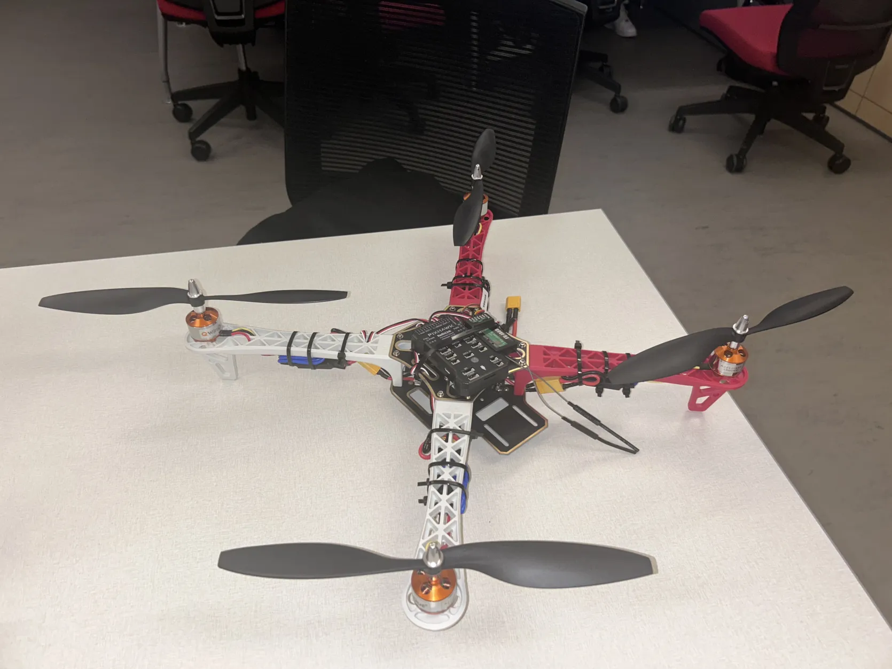
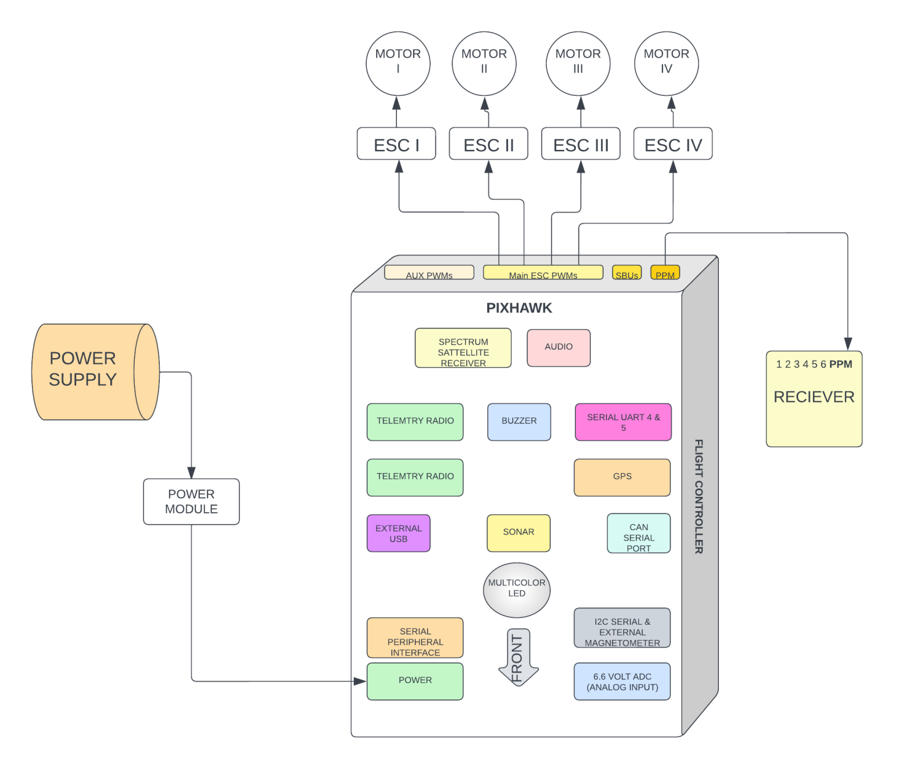

Have you ever wondered about building a drone that could potentially save lives? I've been fortunate to be part of an incredible project aimed at developing a semi-autonomous drone to assist emergency responders. This blog post will explore the technical challenges and innovations involved in building an emergency response drone.

## Conceptualization

The project began with a clear objective: to create a drone that enhances the efficiency of emergency services. My role as a Technical Member involved choosing and integrating the drone's core hardware components.

Here’s a table of the key components we utilized:

| **Component**              | **Description**                                      | **Function**                                                                                   |
|----------------------------|------------------------------------------------------|------------------------------------------------------------------------------------------------|
| **Frame**                  | Carbon fiber, 50 cm x 50 cm x 20 cm                  | Supports and mounts components                                                                 |
| **Flight Controller**      | Pixhawk 4 Mini                                       | Manages flight, navigation, and stability                                                     |
| **Motors & Propellers**    | Brushless DC motors, 12-inch carbon fiber propellers | Provides lift and maneuverability                                                              |
| **Battery**                | LiPo 5000 mAh, 14.8V                                 | Powers the drone                                                                               |
| **Sensors**                | GPS, LiDAR, Ultrasonic, Thermal Camera               | Enables navigation, obstacle avoidance, and search operations                                  |
| **Communication**          | 2.4 GHz telemetry, 5.8 GHz video                     | Facilitates real-time data and video transmission                                              |
| **Computational Unit**     | NVIDIA Jetson Nano                                   | Processes data for autonomous operations                                                       |
| **Software**               | Custom on DroneKit, OpenCV                           | Manages flight and obstacle avoidance, provides control and monitoring interfaces              |

> **Key Takeaway:** Identify your drone's requirements early on—its load capacity, flight range, and data collection capabilities.

## System Design and Integration

We used the Pixhawk 4 Mini flight controller as the central hub for communication with GPS and sensors like LiDAR and ultrasonic for real-time obstacle detection. Each motor is connected to a 30A electronic speed controller (ESC), linked back to the power distribution board for effective power management across all systems.

> **Key Takeaway:** Precise placement and connectivity of components are crucial and often require several iterations to perfect.

## Testing and Optimization

Our initial tests, aimed to be straightforward, presented unexpected challenges. Here’s an overview of our testing activities and the issues we faced:

| Testing Activity                 | Details                                                                 |
|----------------------------------|-------------------------------------------------------------------------|
| Motor Performance Testing        | Extensive testing at various thrust levels, with performance analytics. |
| Motion Orientation Configuration | Setup verified in flight software for stability.                        |
| ESC Recalibration                | Adjusted ESCs for optimal communication with the flight controller.     |
| Weight Monitoring                | Ensured optimal drone weight for performance efficiency.                |
| Propeller Matching               | Confirmed proper configurations for balanced dynamics.                  |

Challenges Encountered:
- **Battery Issues**: Multiple "bad battery" warnings led to a review of our battery management systems.

>**Key Takeaway:** Continuous testing and adjustments are vital. Real-world conditions teach resilience and adaptability.

## Team Collaboration

Collaborating with a diverse team of experts was a key highlight of this project. Everyone’s unique skills contributed significantly, making the drone more than just a machine.

>**Secret to Success:** Effective communication and occasional team meals were essential for team morale.

## The First Flight

Despite legal constraints, our first 10-second test flight was a breakthrough, demonstrating our adherence to safety protocols and our commitment to the project.

We are excited about future possibilities and enhancements for our drone project.

This journey has been both challenging and rewarding, emphasizing the importance of innovation, teamwork, and perseverance in the field of drone technology.